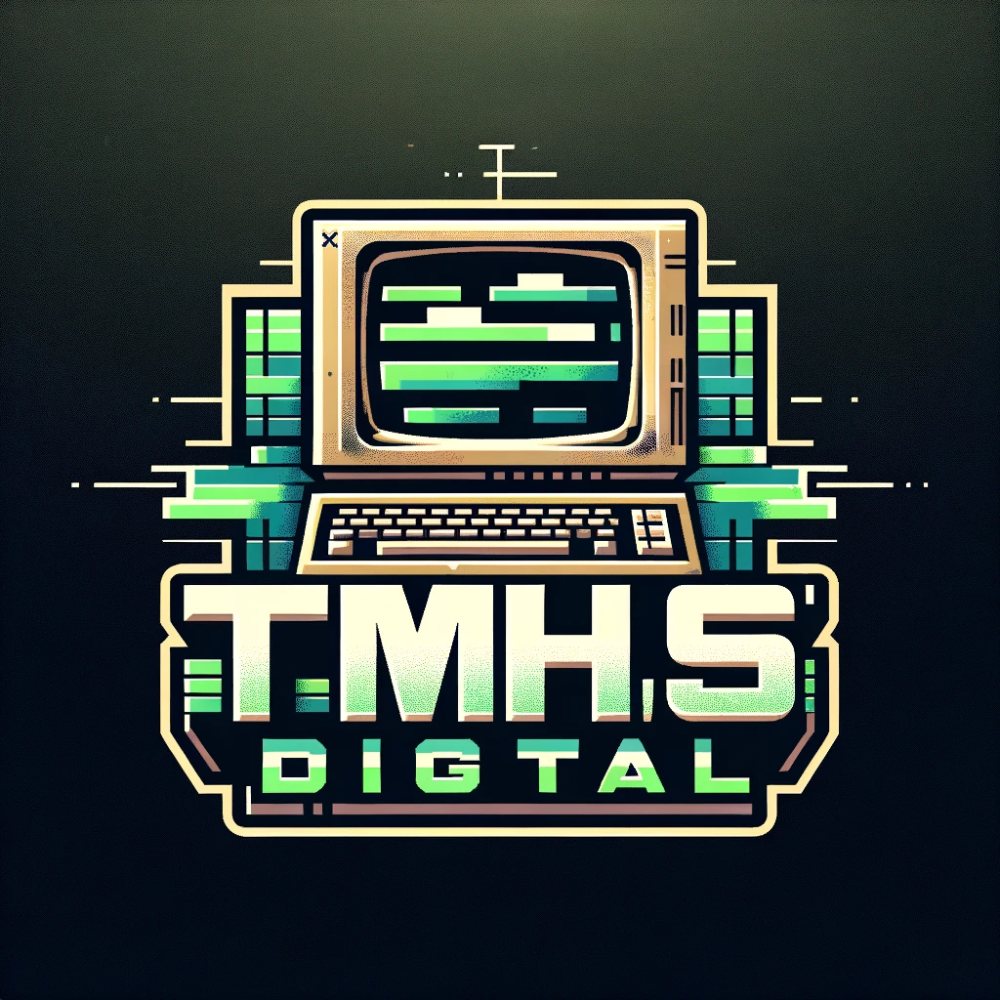
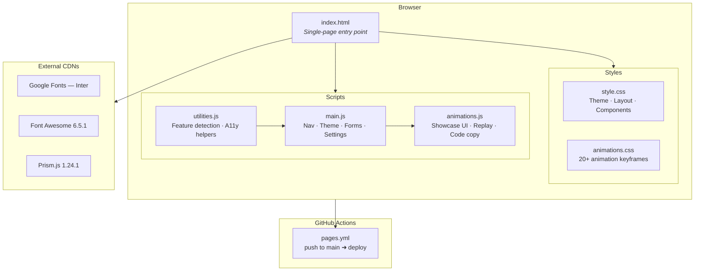

<div align="center">
<br>

<br><br>

# Modern Demo Site

Glass morphism, 20+ CSS animations, and adaptive theming in a single static page<br>with zero build tools and zero framework dependencies.

<br>

[](LICENSE)
[](#)
[](../../actions/workflows/pages.yml)
[](#)
[](#)
[](#)

<br>

`Glass Morphism UI` &middot; `20+ Animations` &middot; `Dark / Light Theme` &middot; `Fully Accessible` &middot; `No Build Step`

<br>

[Live Demo](https://tmhsdigital.github.io/Github-Pages-Demo-1/) | [Quick Start](#installation) | [Architecture](#system-architecture) | [Report Bug](../../issues)

</div>

<br>

---

<br>

## What It Does

| Feature | Capabilities |
| :---- | :---- |
| Glass Morphism UI | Render translucent cards with backdrop blur, dynamic shadows, and 3D perspective transforms. |
| Theme System | Detect system preference, toggle light/dark/high-contrast modes, persist via localStorage. |
| Animation Showcase | Browse 20+ categorized animations with live replay, easing controls, and one-click code copy. |
| Settings Panel | Adjust theme, contrast, and font size at runtime. Bind keyboard shortcuts (D, A, S). |
| Portfolio Grid | Filter project cards by category with animated tab switching and hover overlays. |
| Contact Form | Validate inputs client-side with animated success/error feedback. No backend required. |
| Responsive Layout | Scale fluidly with mobile-first CSS Grid, fluid typography, and touch-optimized targets. |
| Accessibility | Expose ARIA roles, trap focus in modals, announce changes to screen readers, honor reduced-motion. |
| Scroll Progress | Track vertical position with a GPU-accelerated header progress bar. |
| Performance | Preload critical assets, attach passive listeners, leverage content containment and `will-change`. |

<br>

---

<br>

> [!IMPORTANT]
> This project loads fonts and icons from third-party CDNs (Google Fonts, Font Awesome, Prism.js). No data is collected, no cookies are set, and the contact form submits nowhere -- it is a client-side demo only.

<br>

---

<br>

## Installation

Prerequisites: `git` &middot; any static file server (`python3`, `node`, or equivalent)

```bash
git clone https://github.com/TMHSDigital/Github-Pages-Demo-1.git && cd Github-Pages-Demo-1 && python -m http.server 8000
```

Open `http://localhost:8000`. Alternatively use `npx serve` or open `index.html` directly.

> [!CAUTION]
> Opening via `file://` may cause CORS failures for Google Fonts and Font Awesome. Use a local HTTP server.

<br>

---

<br>

## System Architecture



<br>

---

<br>

## Tech Stack

| | |
| :---- | :---- |
| **Core** | HTML5 &middot; CSS3 (custom properties, Grid, Flexbox) &middot; Vanilla JS (ES6+) |
| **External** | Google Fonts (Inter) &middot; Font Awesome 6.5.1 &middot; Prism.js 1.24.1 |
| **Deploy** | GitHub Pages &middot; GitHub Actions (`actions/deploy-pages@v4`) |

<br>

---

<br>

<details>
<summary><strong>Project Anatomy</strong></summary>
<br>

```
Github-Pages-Demo-1/
├── index.html                  # Single-page app — all sections rendered here
├── css/
│   ├── style.css               # Theme system, glass morphism, responsive grid
│   └── animations.css          # Keyframes and transition definitions
├── js/
│   ├── utilities.js            # Feature detection, debounce, a11y announcer
│   ├── main.js                 # Navigation, scroll, theme, forms, settings, portfolio
│   └── animations.js           # Animation showcase gallery, replay, code snippets
├── assets/
│   └── images/
│       ├── TMHSDigital-LOGO.png
│       ├── TMHS-LOGO.png
│       └── preview.png
├── .github/
│   └── workflows/
│       └── pages.yml           # Deploy on push to main
├── LICENSE                     # MIT
└── README.md
```

</details>

<br>

---

<br>

## Contributing

Fork, branch, and open a pull request. Bugs and feature requests belong in [Issues](../../issues).

<br>

---

<br>

<div align="center">

[MIT License](LICENSE) &middot; [TMHSDigital](https://github.com/TMHSDigital)

</div>
