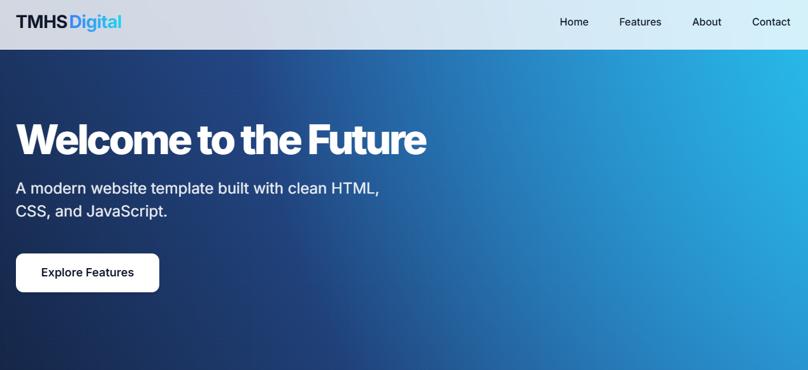

# Modern Demo Site

[](https://tmhsdigital.github.io/Github-Pages-Demo-1/)
[](https://github.com/TMHSDigital/Github-Pages-Demo-1/releases)
[](https://opensource.org/licenses/MIT)
[](https://developer.mozilla.org/en-US/docs/Web/HTML)
[](https://developer.mozilla.org/en-US/docs/Web/CSS)
[](https://developer.mozilla.org/en-US/docs/Web/JavaScript)
[](https://prettier.io/)
[](http://makeapullrequest.com)
[](https://github.com/TMHSDigital/Github-Pages-Demo-1/graphs/commit-activity)

> A sophisticated, modern website template showcasing advanced CSS effects, responsive design, and smooth interactions. Built with pure HTML, CSS, and JavaScript.

<div align="center">
  <a href="https://tmhsdigital.github.io/Github-Pages-Demo-1/">View Demo</a> • 
  <a href="#documentation">Documentation</a> • 
  <a href="../../issues">Report Bug</a> • 
  <a href="../../issues">Request Feature</a>
</div>

<details>
<summary><strong>Preview</strong></summary>
<br>

<div align="center">
  
</div>

</details>

## Table of Contents
- [Getting Started](#getting-started)
- [Highlights](#highlights)
- [Documentation](#documentation)
  - [Prerequisites](#prerequisites)
  - [Installation](#installation)
  - [Project Structure](#project-structure)
- [Customization](#customization)
  - [Theme Configuration](#theme-configuration)
  - [Typography System](#typography-system)
- [Core Components](#core-components)
- [Browser Support](#browser-support)
- [FAQ](#faq)
- [Contributing](#contributing)
- [License](#license)
- [Credits](#credits)

## Getting Started

Experience the future of web design in three simple steps:

1. **Quick Start**: Visit our [live demo](https://tmhsdigital.github.io/Github-Pages-Demo-1/)
2. **Explore Features**: Test the dark mode, responsive layouts, and animations library
3. **Make It Yours**: Fork the repository and customize to your needs

Watch our brief introduction:
<div align="center">
    <a href="https://www.youtube.com/watch?v=your-video-id" target="_blank">
        
    </a>
</div>

## Highlights

<table>
  <tr>
    <td width="50%">

### Modern Design
- Glass morphism UI with dynamic saturation
- Floating gradient backgrounds
- Perspective-based 3D effects
- Dynamic shadow system
- Scroll-based progress indicators

    </td>
    <td width="50%">

### Theme System
- System preference detection
- Smooth theme transitions
- Local storage persistence
- High contrast accessibility
- Real-time theme switching

    </td>
  </tr>
  <tr>
    <td>

### Performance
- Hardware-accelerated transforms
- Strategic content containment
- Optimized will-change usage
- Reduced motion support
- Efficient CSS custom properties

    </td>
    <td>

### Responsive
- Mobile-first architecture
- Fluid typography system
- Dynamic grid layouts
- Touch-optimized interactions
- Adaptive component scaling

    </td>
  </tr>
  <tr>
    <td>

### Animation Library
- 20+ ready-to-use animations
- Interactive code playground
- Copy-paste implementation
- Customization controls
- Keyboard navigation support

    </td>
    <td>

### Accessibility
- Keyboard shortcuts (D for dark mode, A for animations)
- Screen reader announcements
- Focus management
- Reduced motion settings
- ARIA attributes

    </td>
  </tr>
</table>

## Documentation

### Prerequisites
- Modern web browser (Chrome 80+, Firefox 75+, Safari 13.1+, or Edge 80+)
- Basic familiarity with HTML, CSS, and JavaScript
- Local development server (Python 3.x or Node.js 14+)
- Text editor or IDE (VS Code recommended)
- Git for version control

### Installation

1. Clone the repository:
   ```bash
   git clone https://github.com/TMHSDigital/Github-Pages-Demo-1.git
   ```

2. Navigate to the project directory:
   ```bash
   cd Github-Pages-Demo-1
   ```

3. Serve locally using any of these methods:
   ```bash
   # Using Python
   python -m http.server 8000

   # Using Node.js
   npx serve
   ```

4. View in browser:
   ```
   http://localhost:8000
   ```

<details>
<summary>Project Structure</summary>

```
Github-Pages-Demo-1/
├── index.html          # Entry point
├── css/               # Styles
│   ├── style.css      # Main stylesheet
│   └── animations.css # Animation library styles
├── js/                # Scripts
│   ├── main.js        # Core functionality
│   └── animations.js  # Animation library functionality
├── assets/            # Static files
│   └── favicon.ico    # Site favicon
└── README.md          # Documentation
```
</details>

## Customization

<details>
<summary>Theme Configuration</summary>

### Basic Customization
Modify the CSS variables in `css/style.css`:
```css
:root {
    --primary-color: #0f172a;
    --secondary-color: #2563eb;
    --accent-color: #0891b2;
    --text-color: #1e293b;
    --bg-color: #ffffff;
    --glass-bg: rgba(255, 255, 255, 0.7);
}
```

### Advanced Theming
- Customize glass effects via `--glass-bg` and `--glass-border`
- Adjust animation timing with `--transition-speed`
- Modify shadow depths using `--shadow-sm`, `--shadow`, `--shadow-lg`
</details>

<details>
<summary>Typography System</summary>

### Font Configuration
The type system uses [Inter](https://fonts.google.com/specimen/Inter) for optimal legibility.

1. Configure weights in `index.html`:
   ```html
   <link href="https://fonts.googleapis.com/css2?family=Inter:wght@400;500;600;700;800&display=swap" rel="stylesheet">
   ```

2. Adjust scale in `css/style.css`:
   ```css
   html {
       font-size: 16px;
       line-height: 1.6;
   }
   ```
</details>

## Core Components

<details>
<summary>View Components</summary>

### Header
- Glass morphism backdrop filter
- Dynamic scroll behavior
- Gradient-enhanced branding
- Responsive navigation

### Hero Section
- Dynamic gradient system
- SVG pattern overlays
- Animated blob backgrounds
- Optimized CTA placement

### Feature Grid
- Perspective-based 3D cards
- Staggered animations
- Glass morphism effects
- Interactive hover states

### Animation Library
- Categorized animation examples (Transitions, Keyframes, Scroll, Interactive, Text)
- Live interactive demos
- Customizable parameters
- Syntax-highlighted code snippets
- One-click code copying

### Contact Form
- Real-time validation
- Animated feedback states
- Glass morphism styling
- Accessible form controls

### Footer
- Social media integration
- Brand consistency
- Accessibility optimized
- Responsive layout

</details>

## Browser Support

| Browser         | Support | Notes |
|:---------------|:-------:|:------|
| Chrome 80+     |   ✅    | Full  |
| Firefox 75+    |   ✅    | Full  |
| Safari 13.1+   |   ✅    | Full  |
| Edge 80+       |   ✅    | Full  |

## FAQ

<details>
<summary>How do I customize the color scheme?</summary>

Modify the CSS variables in `css/style.css`. See [Theme Configuration](#theme-configuration) for details.
</details>

<details>
<summary>Can I use this template for commercial projects?</summary>

Yes! This project is licensed under MIT. You're free to use it for personal or commercial projects.
</details>

<details>
<summary>How do I deploy to GitHub Pages?</summary>

1. Fork this repository
2. Enable GitHub Pages in your repository settings
3. Select the main branch as source
4. Your site will be live at `https://[username].github.io/Github-Pages-Demo-1`
</details>

<details>
<summary>How do I report a bug?</summary>

Open an issue using our [bug report template](../../issues/new?template=bug_report.md).
Include:
- Expected behavior
- Actual behavior
- Steps to reproduce
- Screenshots if applicable
</details>

<details>
<summary>How do I add new features?</summary>

1. Check our [roadmap](../../projects) for planned features
2. Open a feature request if your idea isn't listed
3. Fork, implement, and submit a PR
</details>

## Contributing

We welcome contributions! Please read our [Contributing Guidelines](CONTRIBUTING.md) before submitting a Pull Request.

### Development Process
1. Fork the repository
2. Create a feature branch
   ```bash
   git checkout -b feature/amazing
   ```
3. Commit your changes
   ```bash
   git commit -m 'Add amazing feature'
   ```
4. Push to your fork
   ```bash
   git push origin feature/amazing
   ```
5. Open a Pull Request

## License

Released under the MIT License. See [LICENSE](LICENSE) for details.

## Credits

- Typography: [Inter](https://fonts.google.com/specimen/Inter) by Rasmus Andersson
- Icons: [Font Awesome](https://fontawesome.com/)
- Inspiration: Modern web design trends and best practices

---

<div align="center">
  <p>
    <a href="https://tmhsdigital.github.io/Github-Pages-Demo-1/">View Demo</a> • 
    <a href="../../issues">Report Bug</a> • 
    <a href="../../issues">Request Feature</a>
  </p>
  
  <sub>Designed and developed by TMHSDigital</sub>
</div>

<details>
<summary>How do I use the animation library?</summary>

The animation library showcase provides ready-to-use animations you can add to your projects:

1. Navigate to the Animations section (press 'A' key for quick access)
2. Browse different animation categories using the tabs
3. Click the "Replay" button to see the animation in action
4. Customize the animation using the duration and easing controls
5. Click "Copy Code" to copy the CSS, HTML, or JavaScript code
6. Paste the code into your project

You can also use left/right arrow keys to navigate between animation categories.
</details> 