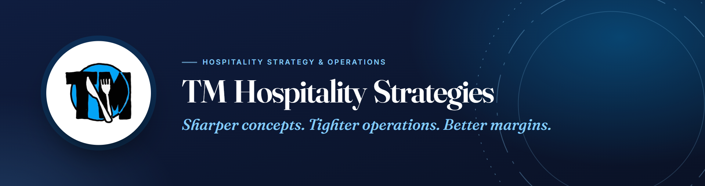
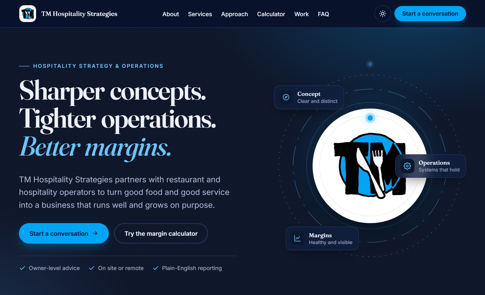
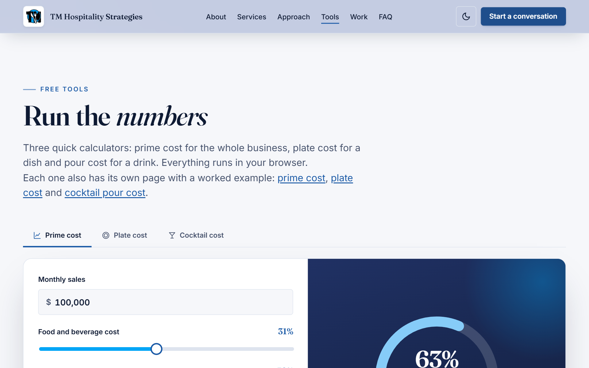
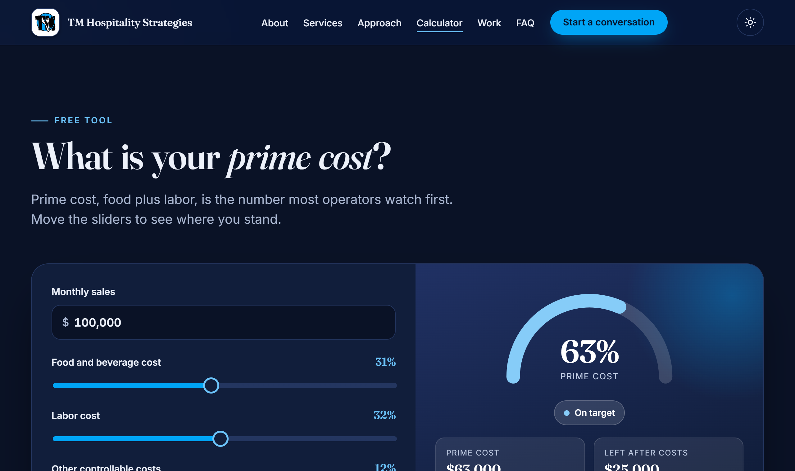
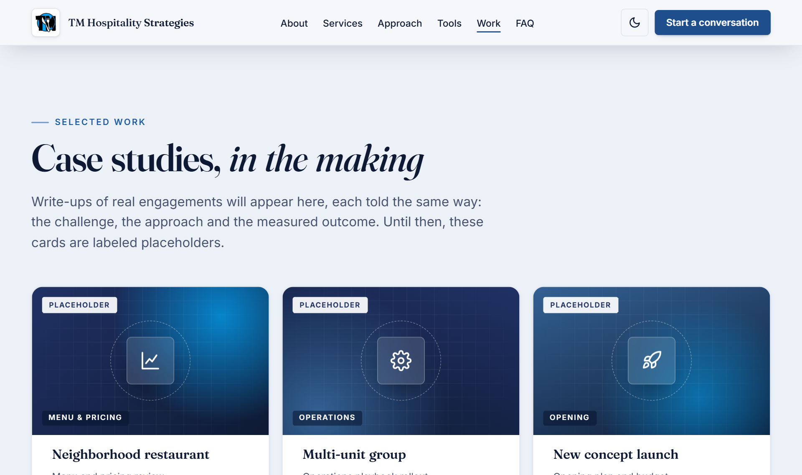
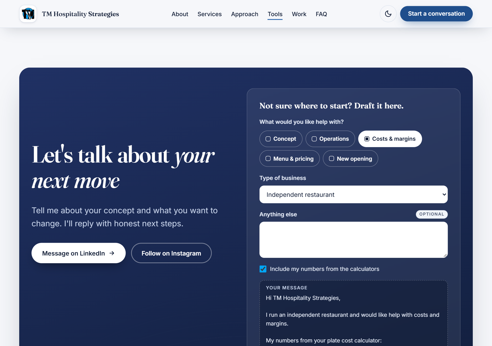

<a id="top"></a>

<div align="center">

<a href="https://tmhsdigital.github.io/Github-Pages-Demo-1/"></a>

<br>

### The official marketing site for TM Hospitality Strategies

A fast, accessible, single-page build with a dark/light theme, three operator cost calculators and a message builder.<br>
No framework, no runtime dependencies.

<br>

[](https://tmhsdigital.github.io/Github-Pages-Demo-1/)

<br>

[](https://github.com/TMHSDigital/Github-Pages-Demo-1/deployments/github-pages)
[](https://github.com/TMHSDigital/Github-Pages-Demo-1/actions/workflows/ci.yml)
[](#quality-gates)
[](#quality-gates)
<br>
[](#quality-gates)
[](#quality-gates)
[](#tech-stack)
[](LICENSE)

<br>

**[Preview](#preview)** &nbsp;·&nbsp; **[Quick start](#quick-start)** &nbsp;·&nbsp; **[Customize](#customize)** &nbsp;·&nbsp; **[Quality gates](#quality-gates)** &nbsp;·&nbsp; **[Roadmap](#roadmap)** &nbsp;·&nbsp; **[Issues](https://github.com/TMHSDigital/Github-Pages-Demo-1/issues)**

</div>

<br>

<table align="center">
  <tr>
    <td align="center" valign="top"><h3>2&nbsp;themes</h3><sub>Light&nbsp;and&nbsp;dark,<br>follows&nbsp;your&nbsp;system</sub></td>
    <td align="center" valign="top"><h3>0&nbsp;requests</h3><sub>No&nbsp;third&#8209;party&nbsp;calls,<br>cookies&nbsp;or&nbsp;analytics</sub></td>
    <td align="center" valign="top"><h3>0&nbsp;violations</h3><sub>axe&#8209;core,&nbsp;WCAG&nbsp;2.2&nbsp;AA,<br>in&nbsp;both&nbsp;themes</sub></td>
    <td align="center" valign="top"><h3>48&nbsp;checks</h3><sub>Browser&nbsp;tests&nbsp;run<br>on&nbsp;every&nbsp;push</sub></td>
  </tr>
</table>

<br>

> [!NOTE]
> **Content status.** The About, Services, Approach, Selected work and FAQ copy is **placeholder text** drafted for layout review. Each spot that needs real information is marked `TODO(verify)` in [`index.html`](index.html), and no testimonials, statistics or client names have been invented. Tracked in [#14](https://github.com/TMHSDigital/Github-Pages-Demo-1/issues/14).

<details>
<summary><b>Table of contents</b></summary>
<br>

<table align="center">
  <tr><td align="right"><b>1&nbsp;·&nbsp;The&nbsp;site</b></td><td><a href="#preview">Preview</a> · <a href="#whats-on-the-page">What's on the page</a> · <a href="#design-system">Design system</a></td></tr>
  <tr><td align="right"><b>2&nbsp;·&nbsp;Build&nbsp;and&nbsp;run</b></td><td><a href="#quick-start">Quick start</a> · <a href="#customize">Customize</a> · <a href="#project-structure">Project structure</a> · <a href="#deployment">Deployment</a></td></tr>
  <tr><td align="right"><b>3&nbsp;·&nbsp;Quality</b></td><td><a href="#quality-gates">Quality gates</a> · <a href="#tech-stack">Tech stack</a> · <a href="#privacy-and-security">Privacy and security</a> · <a href="#roadmap">Roadmap</a></td></tr>
</table>

</details>

<br>

---

<p align="center"><sub><b>PART 1 · THE SITE</b></sub></p>

## Preview

<sub>The site in both themes. It follows the visitor's system setting and has a manual toggle.</sub>

<table width="100%">
  <tr>
    <td width="50%" align="center" valign="top">
      
      <br><sub><b>Light</b> · hero</sub>
    </td>
    <td width="50%" align="center" valign="top">
      
      <br><sub><b>Dark</b> · hero</sub>
    </td>
  </tr>
  <tr>
    <td width="50%" align="center" valign="top">
      
      <br><sub><b>Light</b> · prime cost</sub>
    </td>
    <td width="50%" align="center" valign="top">
      
      <br><sub><b>Dark</b> · cocktail cost</sub>
    </td>
  </tr>
  <tr>
    <td width="50%" align="center" valign="top">
      
      <br><sub><b>Selected work</b> · placeholders</sub>
    </td>
    <td width="50%" align="center" valign="top">
      
      <br><sub><b>Contact</b> · message builder</sub>
    </td>
  </tr>
  <tr>
    <td width="50%" align="center" valign="top">
      
      <br><sub><b>Services</b> · bento layout</sub>
    </td>
    <td width="50%" align="center" valign="top">
      
      <br><sub><b>Approach</b> · scroll-linked progress line</sub>
    </td>
  </tr>
</table>

<div align="center">

<table>
  <tr>
    <td align="center" valign="top">
      
      <br><sub><b>Mobile</b> · 390px</sub>
    </td>
    <td align="center" valign="top">
      
      <br><sub><b>Mobile menu</b> · keyboard operable</sub>
    </td>
  </tr>
</table>

<sub>Screenshots, the banner and the social card are generated by <a href="scripts/screenshots.cjs"><code>scripts/screenshots.cjs</code></a>.</sub>

</div>

<div align="right"><sub><a href="#top">↑ Back to top</a></sub></div>

---

## What's on the page

| Section | Purpose |
| :-- | :-- |
| **Header** | Sticky glass bar with section links, a current-section indicator, a reading-progress line and a dark/light toggle with a circular reveal. |
| **Hero** | Value proposition, two calls to action and an animated brand scene (orbiting light, drifting rings, pointer parallax on fine pointers). |
| **Focus marquee** | Pausable strip of service areas and venue types. It names no clients. |
| **About** | The story behind the brand, a pull quote and three principles. |
| **Services** | Bento grid: concept and positioning, operations, financial performance, growth and openings. |
| **Approach** | Listen, diagnose, build, sustain, joined by a progress line that fills as you scroll. |
| **Operator toolkit** | Three tabbed calculators that run entirely in the browser. **Prime cost**: sliders, a live gauge and rule-of-thumb band, a breakdown of where each sales dollar goes and what each point of prime cost is worth. **Plate cost** and **cocktail cost**: ingredient or pour rows (bottle price, size and pour), a target cost % and an optional menu price, giving a suggested price, actual cost % and gross profit. Any result can be shared as a link, and "Talk through these numbers" carries it into the contact message. |
| **Selected work** | Case-study cards with a blueprint cover and a challenge, approach and outcome outline, labeled as placeholders until real write-ups exist. |
| **FAQ** | Two-column layout: a short intro with an "Ask something else" link beside a native `<details>` accordion. |
| **Contact** | LinkedIn and Instagram, plus a message builder: pick topics and a business type, add a note and, optionally, the calculator results, then copy the message or (once an email is configured) send it with `mailto:`. On mobile a quick-contact bar appears between the hero and this section. |
| **404** | Branded error page that resolves its assets correctly from any nested URL. |

<div align="right"><sub><a href="#top">↑ Back to top</a></sub></div>

---

## Design system

<sub>Tokens live in <a href="css/tokens.css"><code>css/tokens.css</code></a> and follow the TM Hospitality Strategies Canva brand kit and logo.</sub>

<table width="100%">
  <tr>
    <td align="center" width="16%"><br><sub><b>Navy</b><br><code>#0E1A33</code></sub></td>
    <td align="center" width="16%"><br><sub><b>Brand</b><br><code>#203164</code></sub></td>
    <td align="center" width="16%"><br><sub><b>Brand&nbsp;blue</b><br><code>#336193</code></sub></td>
    <td align="center" width="16%"><br><sub><b>Action</b><br><code>#1F4E8C</code></sub></td>
    <td align="center" width="16%"><br><sub><b>Logo&nbsp;blue</b><br><code>#00A5F6</code></sub></td>
    <td align="center" width="16%"><br><sub><b>Canvas</b><br><code>#F6F7FA</code></sub></td>
  </tr>
</table>

| Principle | How it shows up |
| :-- | :-- |
| **Tokens** | Fluid type and spacing scales, elevation and glow tokens, with complete light and dark sets. |
| **Type** | Fraunces (with true italics for accent words) for headings and Inter for text: self-hosted variable fonts, subset to Latin and trimmed to the weights used (149 KB in total). |
| **Theme** | Follows the system setting until the visitor chooses, then remembers the choice. No flash on load. |
| **Contrast** | Every text pairing is chosen for WCAG AA and verified by axe in both themes. The bright logo blue is decorative, or used for text only on navy. |
| **Motion** | Transforms and opacity only, paused or disabled under `prefers-reduced-motion`. Content is fully visible without JavaScript. |

<div align="right"><sub><a href="#top">↑ Back to top</a></sub></div>

---

<p align="center"><sub><b>PART 2 · BUILD AND RUN</b></sub></p>

## Quick start

> [!TIP]
> There is nothing to install. Any static file server works.

```bash
git clone https://github.com/TMHSDigital/Github-Pages-Demo-1.git
cd Github-Pages-Demo-1
python -m http.server 8000      # or: npx serve
```

Then open <http://localhost:8000>.

<div align="right"><sub><a href="#top">↑ Back to top</a></sub></div>

---

## Customize

<sub>Everything is plain files. Change it, reload the page.</sub>

| To change | Do this |
| :-- | :-- |
| **Copy and sections** | Edit [`index.html`](index.html). Search for `TODO(verify)` to find placeholder text. |
| **Colors, fonts, spacing** | Edit the tokens in [`css/tokens.css`](css/tokens.css). Light values are in `:root`, dark in `[data-theme="dark"]`. |
| **Calculator bands** | Edit `band()` in [`js/calc-math.js`](js/calc-math.js) and the note under the calculator in `index.html`. Band colors are the `--band-*` tokens. Confirm the ranges before relying on them. |
| **Example recipes and targets** | Edit `defaults()` in [`js/calc-recipe.js`](js/calc-recipe.js) and the matching static values in `index.html`. |
| **Contact email** | Set `CONTACT_EMAIL` in [`js/inquiry.js`](js/inquiry.js). While empty, the buttons point to LinkedIn and the message is copied instead of emailed. |
| **Logo** | Replace `assets/images/tmhs-logo.png` and `tmhs-logo-96.png` (an SVG master is tracked in [#16](https://github.com/TMHSDigital/Github-Pages-Demo-1/issues/16)). |
| **Social card, banner, screenshots** | Run `node scripts/screenshots.cjs` after changing the page. |
| **Repo name or domain** | Update `og:url`, canonical, `sitemap.xml`, `robots.txt` and the `<base>` in `404.html`. |

<div align="right"><sub><a href="#top">↑ Back to top</a></sub></div>

---

## Project structure

<details>
<summary><b>Show the file tree</b></summary>

```text
.
├── index.html               Single page: hero, about, services, approach, toolkit, work, FAQ, contact
├── 404.html                 Branded error page (uses <base> for the repo path)
├── css/
│   ├── tokens.css           Fonts, brand tokens, fluid scales, light and dark themes
│   ├── base.css             Reset, typography, layout primitives, buttons, reveal rules
│   └── components.css       Header, hero scene, marquee, sections, toolkit, contact, footer
├── js/
│   ├── theme.js             Dark/light toggle (pre-paint snippet lives in index.html)
│   ├── calc-math.js         Pure calculator maths (TMHSCalc) and the tool registry
│   ├── calc-prime.js        Prime cost tool: gauge, breakdown, what-if
│   ├── calc-recipe.js       Plate and cocktail cost tools (one shared row-based tool)
│   ├── calc-tabs.js         Toolkit tabs, shared links and copy link
│   ├── inquiry.js           Contact message builder and CONTACT_EMAIL
│   └── main.js              Menu, scroll reveal, nav spy, parallax, marquee pause, quick-contact bar
├── assets/
│   ├── fonts/               Self-hosted Fraunces (upright and italic) and Inter, latin variable woff2
│   └── images/              Logo, small logo, favicon, apple-touch icon, social card
├── tests/smoke.cjs          Layout, keyboard, theme, toolkit, contact and axe checks (Playwright)
├── scripts/
│   ├── stage.cjs            Builds the publishable _site (minified CSS/JS, site files only)
│   ├── check-links.cjs      External link checker
│   └── screenshots.cjs      Regenerates docs/screenshots, the banner and the social card
├── docs/                    README banner source and screenshots
├── package.json             Pinned build and test tooling (no runtime dependencies)
├── eslint.config.cjs        Lint rules
├── CONTRIBUTING.md  SECURITY.md  LICENSE
└── .github/
    ├── workflows/ci.yml     Validation, tests, Lighthouse, link checks, then deploy
    └── dependabot.yml       Weekly GitHub Actions and npm tooling updates
```

</details>

<div align="right"><sub><a href="#top">↑ Back to top</a></sub></div>

---

## Deployment

Every push to `main` runs [`ci.yml`](.github/workflows/ci.yml): it builds `_site/` with [`scripts/stage.cjs`](scripts/stage.cjs), runs every quality gate against it, and only if they all pass publishes that exact `_site/` to GitHub Pages. The build bundles and minifies the CSS (inlined into the home page to save a render-blocking request), minifies the scripts, adds a hash-based Content-Security-Policy and copies only site files (`index.html`, `404.html`, `robots.txt`, `sitemap.xml`, `assets`). Source files stay unbundled for development.

<details>
<summary><b>Preview the published build locally</b></summary>

```bash
npm ci
npm run build && cd _site && python -m http.server 8000
```

</details>

<div align="right"><sub><a href="#top">↑ Back to top</a></sub></div>

---

<p align="center"><sub><b>PART 3 · QUALITY AND ROADMAP</b></sub></p>

## Quality gates

<sub><a href="https://github.com/TMHSDigital/Github-Pages-Demo-1/actions/workflows/ci.yml"><code>ci.yml</code></a> runs on every push and pull request. Tool versions are pinned in <code>package.json</code> and installed with <code>npm ci</code>.</sub>

| Gate | Tool | Standard |
| :-- | :-- | :-- |
| **HTML validity** | `html-validate` | No errors |
| **JavaScript lint** | ESLint | No errors |
| **Layout** | Playwright, source and staged build | No horizontal scroll at 375, 768 and 1280px; no console errors |
| **Features** | Playwright | Theme toggle persists and follows the system; prime, plate and cocktail maths, live readouts, caret-safe formatting and reset; ingredient rows add, remove and cap at 12; shared links open the right tool with their numbers and copy link round-trips; the message builder includes calculator results and switches to `mailto:` when an email is set; the mobile quick-contact bar shows and hides; marquee pauses; one header call to action per layout; valid JSON-LD |
| **Resilience** | Playwright | With JavaScript off, or if the main script fails to load, all content stays visible; the mobile nav stays reachable |
| **Keyboard** | Playwright | Skip link first, menu moves focus into its links and closes on Escape or an outside click, toolkit tabs follow the ARIA arrow/Home/End pattern, focus stays put when rows are added or removed, FAQ operable, visible focus rings |
| **Reflow and spacing** | Playwright | No sideways scrolling or cut-off content at 320px and 640px (400% and 200% zoom), including with WCAG text-spacing overrides |
| **Accessibility** | axe-core | 0 violations (WCAG 2.0, 2.1 and 2.2 A/AA, best practice) at mobile and desktop, in both themes and with reduced motion, including the plate and cocktail tools and a filled-in message |
| **Security** | Playwright, staged build | Content-Security-Policy present on every page and no violations while using the theme toggle, toolkit tabs, message builder and 404 page |
| **Performance and quality** | Lighthouse, staged build | Performance 90 or higher; Accessibility, Best Practices and SEO 95 or higher |
| **Links** | internal and external checkers | No broken links |

<details>
<summary><b>Run the checks locally</b></summary>

```bash
npm ci            # pinned tooling; tests use your installed Chrome
npm run check     # HTML validation, lint, tests on the source and on the published build
npm run links     # external link check
```

</details>

> [!IMPORTANT]
> Automated checks do not replace a real screen-reader review. A manual NVDA and VoiceOver pass is still recommended before launch ([#17](https://github.com/TMHSDigital/Github-Pages-Demo-1/issues/17)).

<div align="right"><sub><a href="#top">↑ Back to top</a></sub></div>

---

## Tech stack

<div align="center">


<sub>No framework, no bundler in development and no runtime dependencies.<br>Playwright, axe-core and esbuild are used only for testing and publishing and are never shipped.</sub>

</div>

<div align="right"><sub><a href="#top">↑ Back to top</a></sub></div>

---

## Privacy and security

- The site makes **no third-party requests**: fonts are self-hosted, and there are no cookies, analytics or forms. The calculators and the message builder run locally and never store or send what you enter. A shared calculator link carries its numbers in the URL, and only to whoever you give it to.
- The published pages carry a strict Content-Security-Policy: only the site's own files run, and the few inline blocks are allowed by hash (generated in `scripts/stage.cjs`).
- GitHub Actions are pinned to commit SHAs and kept current by Dependabot.
- Found a vulnerability? See [SECURITY.md](SECURITY.md) and report it privately through the repository's **Security** tab.

<div align="right"><sub><a href="#top">↑ Back to top</a></sub></div>

---

## Roadmap

<sub>Open work is tracked in <a href="https://github.com/TMHSDigital/Github-Pages-Demo-1/issues">Issues</a>, grouped here by what each item is waiting on.</sub>

**Needs your input**

- [ ] Replace placeholder copy with real content ([#14](https://github.com/TMHSDigital/Github-Pages-Demo-1/issues/14))
- [ ] Choose a contact method, email or booking link ([#15](https://github.com/TMHSDigital/Github-Pages-Demo-1/issues/15))
- [ ] Confirm the prime cost bands and the example plate and cocktail recipes and targets ([#27](https://github.com/TMHSDigital/Github-Pages-Demo-1/issues/27))
- [ ] Provide the original vector logo ([#16](https://github.com/TMHSDigital/Github-Pages-Demo-1/issues/16))
- [ ] Add photography and richer visuals ([#20](https://github.com/TMHSDigital/Github-Pages-Demo-1/issues/20))

**Needs a decision**

- [ ] Rename the repo or move to a custom domain ([#18](https://github.com/TMHSDigital/Github-Pages-Demo-1/issues/18))
- [ ] How TMHS and TMHS Digital relate on the site ([#19](https://github.com/TMHSDigital/Github-Pages-Demo-1/issues/19))
- [ ] Analytics and privacy statement ([#29](https://github.com/TMHSDigital/Github-Pages-Demo-1/issues/29))

**Open to work**

- [ ] Manual screen-reader and zoom review ([#17](https://github.com/TMHSDigital/Github-Pages-Demo-1/issues/17))

<div align="right"><sub><a href="#top">↑ Back to top</a></sub></div>

---

<div align="center">

<br>


**TM Hospitality Strategies**

<sub><a href="https://www.linkedin.com/company/tm-hospitality-strategies/">LinkedIn</a> &nbsp;·&nbsp; <a href="https://www.instagram.com/tmhs.ig/">Instagram</a> &nbsp;·&nbsp; <a href="LICENSE">MIT License</a></sub>

</div>
