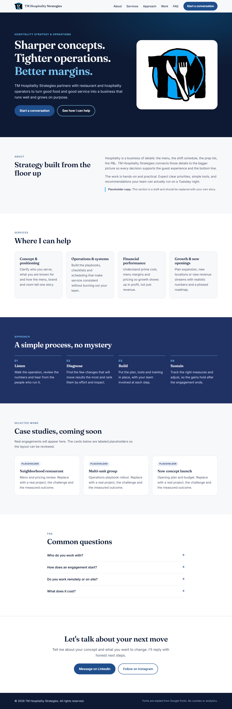

<div align="center">


# TM Hospitality Strategies

**Marketing site for TM Hospitality Strategies: strategy and operations consulting for restaurants and hospitality.**

A single-page static site. Vanilla HTML, CSS and JS, no framework, no build step.

[Live site](https://tmhsdigital.github.io/Github-Pages-Demo-1/)

</div>

> [!NOTE]
> Copy in the About, Services, Case studies and FAQ sections is **placeholder text** drafted for layout review. Every place that needs your real information is marked `TODO(verify)` in `index.html`. No testimonials, statistics or client names have been invented.

## Preview



## Structure

```
index.html            # Single page: hero, about, services, approach, work, FAQ, contact
404.html              # Branded error page (uses <base> for the repo path)
css/style.css         # Brand tokens (:root) and all styles
js/main.js            # Mobile menu, footer year, optional mailto CTA
assets/images/        # Logo, favicon, apple-touch icon, og-image
.github/workflows/    # pages.yml (deploy), ci.yml (HTML validate + JS lint on PRs)
```

## Run locally

```bash
python -m http.server 8000
```

Open `http://localhost:8000`.

## Customize

- **Colors and fonts:** edit the tokens at the top of `css/style.css`. They come from the TM Hospitality Strategies Canva brand kit (`#203164`, `#336193`) and the logo blue (`#00A5F6`).
- **Contact email:** set `CONTACT_EMAIL` in `js/main.js`. While it is empty, the contact button links to LinkedIn.
- **Content:** search `index.html` for `TODO(verify)` and replace the placeholder copy.
- **Logo:** `assets/images/tmhs-logo.png` is a raster export from Canva. Replace it with an SVG when one is available.

## Deployment

Pushing to `main` runs `.github/workflows/pages.yml`, which publishes only the site files to GitHub Pages.

## Privacy

Fonts load from Google Fonts. The site sets no cookies and has no analytics. There is no contact form.

## License

[MIT](LICENSE)
