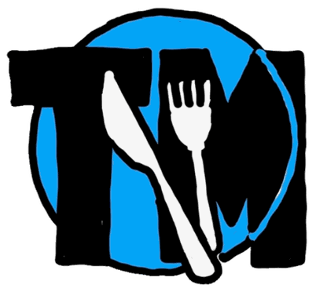
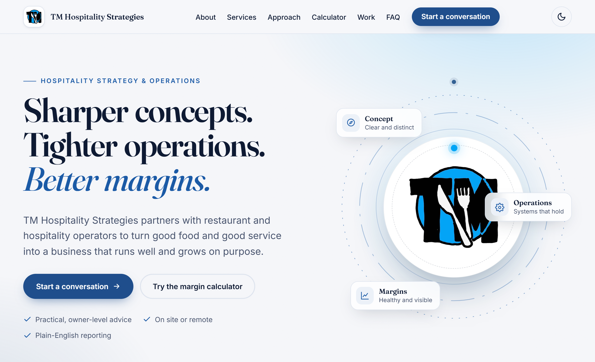
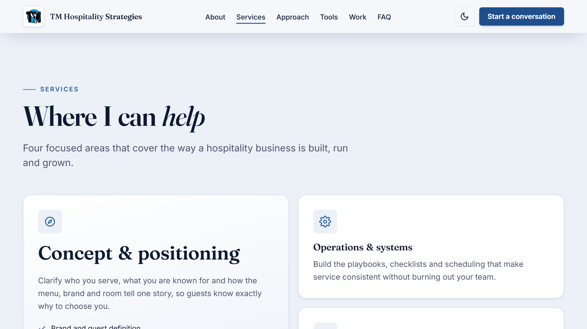
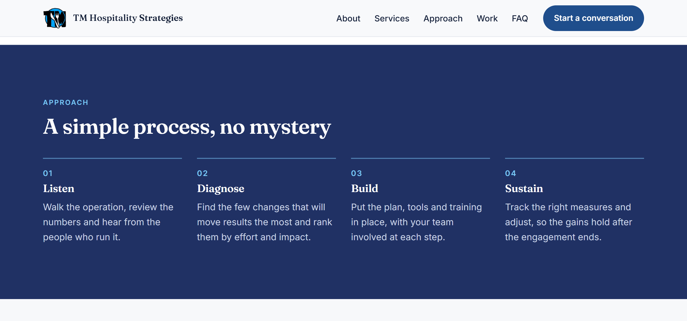
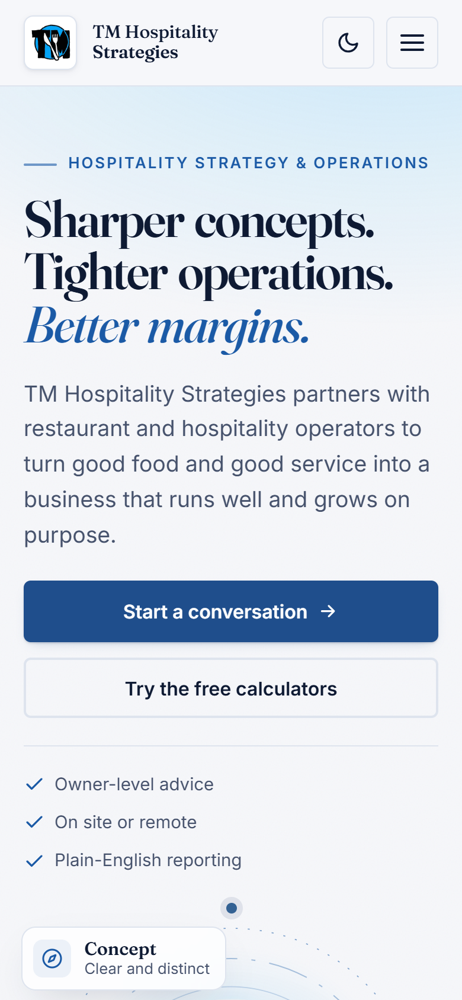
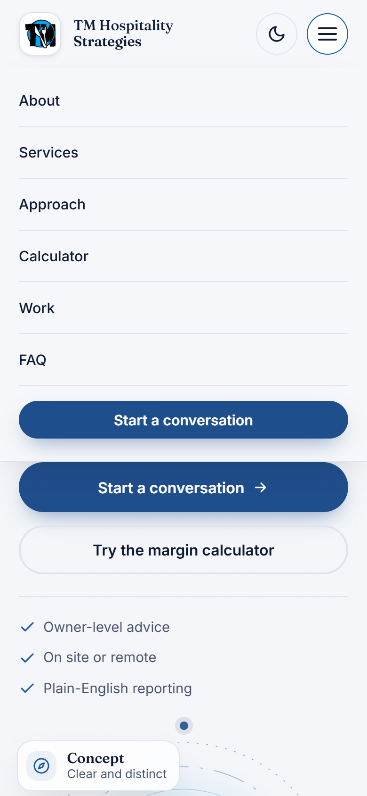

<div align="center">



# TM Hospitality Strategies

**Strategy and operations consulting for restaurants and hospitality.**<br>
The official marketing site: a fast, accessible, single-page build with no framework and no build step.

<br>

[](https://tmhsdigital.github.io/Github-Pages-Demo-1/)

[](https://github.com/TMHSDigital/Github-Pages-Demo-1/actions/workflows/pages.yml)
[](https://github.com/TMHSDigital/Github-Pages-Demo-1/actions/workflows/ci.yml)
[](#quality-gates)
[](#quality-gates)
[](#quality-gates)
[](#tech-stack)
[](LICENSE)

<br>

[**Live site**](https://tmhsdigital.github.io/Github-Pages-Demo-1/) &nbsp;·&nbsp; [Preview](#preview) &nbsp;·&nbsp; [Quick start](#quick-start) &nbsp;·&nbsp; [Customize](#customize) &nbsp;·&nbsp; [Quality gates](#quality-gates) &nbsp;·&nbsp; [Open issues](https://github.com/TMHSDigital/Github-Pages-Demo-1/issues)

</div>

<br>

> [!NOTE]
> **Content status.** The About, Services, Approach, Selected work and FAQ copy is **placeholder text** drafted for layout review. Each spot that needs real information is marked `TODO(verify)` in [`index.html`](index.html), and no testimonials, statistics or client names have been invented. Tracked in [#14](https://github.com/TMHSDigital/Github-Pages-Demo-1/issues/14).

<br>

## Contents

<div align="center">

**The site** &nbsp;·&nbsp; [Preview](#preview) &nbsp;·&nbsp; [What's on the page](#whats-on-the-page) &nbsp;·&nbsp; [Design system](#design-system)

**Build and run** &nbsp;·&nbsp; [Quick start](#quick-start) &nbsp;·&nbsp; [Project structure](#project-structure) &nbsp;·&nbsp; [Customize](#customize) &nbsp;·&nbsp; [Deployment](#deployment)

**Quality** &nbsp;·&nbsp; [Quality gates](#quality-gates) &nbsp;·&nbsp; [Tech stack](#tech-stack) &nbsp;·&nbsp; [Privacy](#privacy) &nbsp;·&nbsp; [Roadmap](#roadmap)

</div>

<br>

## Preview

<div align="center">
  
  <br><sub><b>Hero</b> · desktop 1280px</sub>
</div>

<br>

<table width="100%">
  <tr>
    <td width="50%" align="center" valign="top">
      
      <br><sub><b>Services</b> · four focused offers</sub>
    </td>
    <td width="50%" align="center" valign="top">
      
      <br><sub><b>Approach</b> · a four-step process</sub>
    </td>
  </tr>
</table>

<br>

<table align="center">
  <tr>
    <td align="center" valign="top">
      
      <br><sub><b>Mobile</b> · 390px</sub>
    </td>
    <td align="center" valign="top">
      
      <br><sub><b>Mobile menu</b> · keyboard operable</sub>
    </td>
  </tr>
</table>

<sub>Screenshots are generated by [`scripts/screenshots.cjs`](scripts/screenshots.cjs).</sub>

<br>

## What's on the page

| Section | Purpose |
| :-- | :-- |
| **Hero** | States the value proposition and one clear next step. |
| **About** | Introduces the person and approach behind the brand. |
| **Services** | Concept and positioning, operations and systems, financial performance, growth and openings. |
| **Approach** | Listen, diagnose, build, sustain. |
| **Selected work** | Case-study cards, currently labeled placeholders. |
| **FAQ** | Native `<details>` accordion, fully keyboard operable with no JavaScript. |
| **Contact** | LinkedIn and Instagram, with an optional `mailto:` once an email is configured. |
| **404** | Branded error page that resolves its assets correctly from any nested URL. |

<br>

## Design system

Tokens live at the top of [`css/style.css`](css/style.css) and follow the TM Hospitality Strategies Canva brand kit and logo.

<table width="100%">
  <tr>
    <td align="center" width="16%"><br><sub><b>Navy</b><br><code>#0E1A33</code></sub></td>
    <td align="center" width="16%"><br><sub><b>Brand</b><br><code>#203164</code></sub></td>
    <td align="center" width="16%"><br><sub><b>Brand&nbsp;blue</b><br><code>#336193</code></sub></td>
    <td align="center" width="16%"><br><sub><b>Action</b><br><code>#1F4E8C</code></sub></td>
    <td align="center" width="16%"><br><sub><b>Logo&nbsp;blue</b><br><code>#00A5F6</code></sub></td>
    <td align="center" width="16%"><br><sub><b>Canvas</b><br><code>#F7F8FA</code></sub></td>
  </tr>
</table>

- **Type:** Fraunces for headings, Inter for text. Both are self-hosted variable fonts.
- **Contrast:** text pairings are chosen for WCAG AA. The bright logo blue is decorative, or used for text only on navy.
- **Motion:** minimal, and disabled under `prefers-reduced-motion`.

<br>

## Quick start

> [!TIP]
> There is nothing to install. Any static file server works.

```bash
git clone https://github.com/TMHSDigital/Github-Pages-Demo-1.git
cd Github-Pages-Demo-1
python -m http.server 8000      # or: npx serve
```

Then open <http://localhost:8000>.

<br>

## Project structure

```text
.
├── index.html               Single page: hero, about, services, approach, work, FAQ, contact
├── 404.html                 Branded error page (uses <base> for the repo path)
├── css/style.css            Fonts, brand tokens (:root) and all styles
├── js/main.js               Mobile menu, footer year, optional CONTACT_EMAIL mailto
├── assets/
│   ├── fonts/               Self-hosted Fraunces and Inter (latin, variable woff2)
│   └── images/              Logo, favicon, apple-touch icon, social preview
├── tests/smoke.cjs          Layout, keyboard and axe accessibility checks
├── scripts/
│   ├── check-links.cjs      External link checker
│   └── screenshots.cjs      Regenerates docs/screenshots
├── docs/screenshots/        README images
└── .github/
    ├── workflows/pages.yml  Deploys site files to GitHub Pages
    ├── workflows/ci.yml     Validation, tests, Lighthouse, link checks
    └── dependabot.yml       Weekly GitHub Actions updates
```

<br>

## Customize

| To change | Do this |
| :-- | :-- |
| **Copy and sections** | Edit [`index.html`](index.html). Search for `TODO(verify)` to find placeholder text. |
| **Colors and fonts** | Edit the tokens at the top of [`css/style.css`](css/style.css). |
| **Contact email** | Set `CONTACT_EMAIL` in [`js/main.js`](js/main.js). While empty, the button links to LinkedIn. |
| **Logo** | Replace `assets/images/tmhs-logo.png` (an SVG master is tracked in [#16](https://github.com/TMHSDigital/Github-Pages-Demo-1/issues/16)). |
| **Social preview** | Replace `assets/images/og-image.png` (1200 × 630). |
| **Repo name or domain** | Update `og:url`, canonical, `sitemap.xml`, `robots.txt` and the `<base>` in `404.html`. |

<br>

## Deployment

Every push to `main` runs [`pages.yml`](.github/workflows/pages.yml), which stages only the site files (`index.html`, `404.html`, `robots.txt`, `sitemap.xml`, `css`, `js`, `assets`) and publishes them to GitHub Pages.

<br>

## Quality gates

[`ci.yml`](.github/workflows/ci.yml) runs on every push and pull request.

| Gate | Tool | Standard |
| :-- | :-- | :-- |
| HTML validity | `html-validate` | No errors |
| JavaScript lint | ESLint | No errors |
| Layout | Playwright | No horizontal scroll at 375, 768 and 1280px; no console errors |
| Keyboard | Playwright | Skip link first, menu and FAQ operable, Escape returns focus, visible focus rings |
| Accessibility | axe-core | 0 violations (WCAG 2.0, 2.1 and 2.2 A/AA, best practice) at mobile, desktop and reduced motion |
| Performance and quality | Lighthouse | 95 or higher in Performance, Accessibility, Best Practices and SEO |
| Links | internal and external checkers | No broken links |

Run the browser checks locally:

```bash
npm i --no-save playwright axe-core    # uses your installed Chrome
node tests/smoke.cjs
node scripts/check-links.cjs
```

> [!IMPORTANT]
> Automated checks do not replace a real screen-reader review. A manual NVDA and VoiceOver pass is still recommended before launch.

<br>

## Tech stack

<div align="center">


</div>

No framework, no bundler and no runtime dependencies. Playwright and axe-core are used only for testing and are never shipped.

<br>

## Privacy

The site makes **no third-party requests**: fonts are self-hosted, and there are no cookies, analytics or contact forms.

<br>

## Roadmap

Open work is tracked in [Issues](https://github.com/TMHSDigital/Github-Pages-Demo-1/issues):

- Real copy and case studies ([#14](https://github.com/TMHSDigital/Github-Pages-Demo-1/issues/14))
- Contact method ([#15](https://github.com/TMHSDigital/Github-Pages-Demo-1/issues/15))
- Vector logo ([#16](https://github.com/TMHSDigital/Github-Pages-Demo-1/issues/16))
- Repo rename and housekeeping ([#18](https://github.com/TMHSDigital/Github-Pages-Demo-1/issues/18))
- Brand relationship with TMHS Digital ([#19](https://github.com/TMHSDigital/Github-Pages-Demo-1/issues/19))
- Photography ([#20](https://github.com/TMHSDigital/Github-Pages-Demo-1/issues/20))

<br>

<div align="center">


**TM Hospitality Strategies**<br>
<sub>[LinkedIn](https://www.linkedin.com/company/tm-hospitality-strategies/) &nbsp;·&nbsp; [Instagram](https://www.instagram.com/tmhs.ig/) &nbsp;·&nbsp; [MIT License](LICENSE)</sub>

</div>
